# Architecture

This document describes the internal architecture of LocalAGI, covering component design, data flow, deployment patterns, and key engineering decisions.

---

## High-Level System Overview

LocalAGI is a self-hosted AI agent platform written in Go with a React frontend. It orchestrates multiple independent AI agents, each with its own connectors, actions, memory, and knowledge base. The system communicates with a local LLM inference server (LocalAI) through an OpenAI-compatible API and exposes its own REST/SSE API consumed by the Web UI and external integrations.

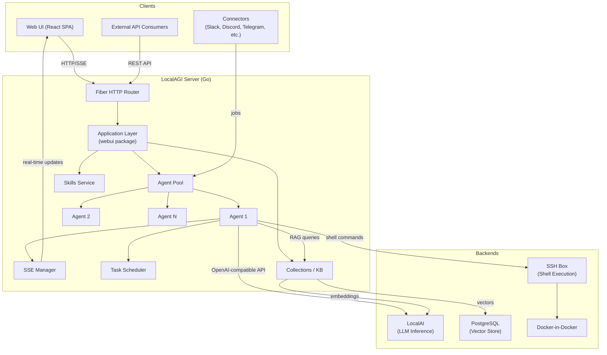

---

## Component Architecture

The codebase is organized into four top-level packages plus the entry point:

| Package | Purpose |
|---------|---------|
| `core/` | Agent runtime, state management, types, SSE, scheduling |
| `pkg/` | Shared utilities: LLM client, vector stores, config metadata |
| `services/` | Pluggable connectors, actions, filters, prompts, skills |
| `webui/` | HTTP API server (Fiber) and embedded React frontend |

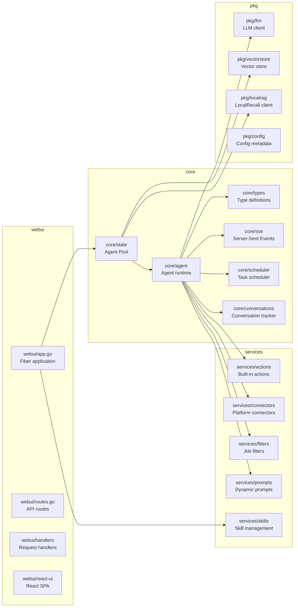

---

## Data Flow

### Request Processing

Every interaction — whether from the Web UI, an API call, or a connector message — follows the same job-based pipeline:

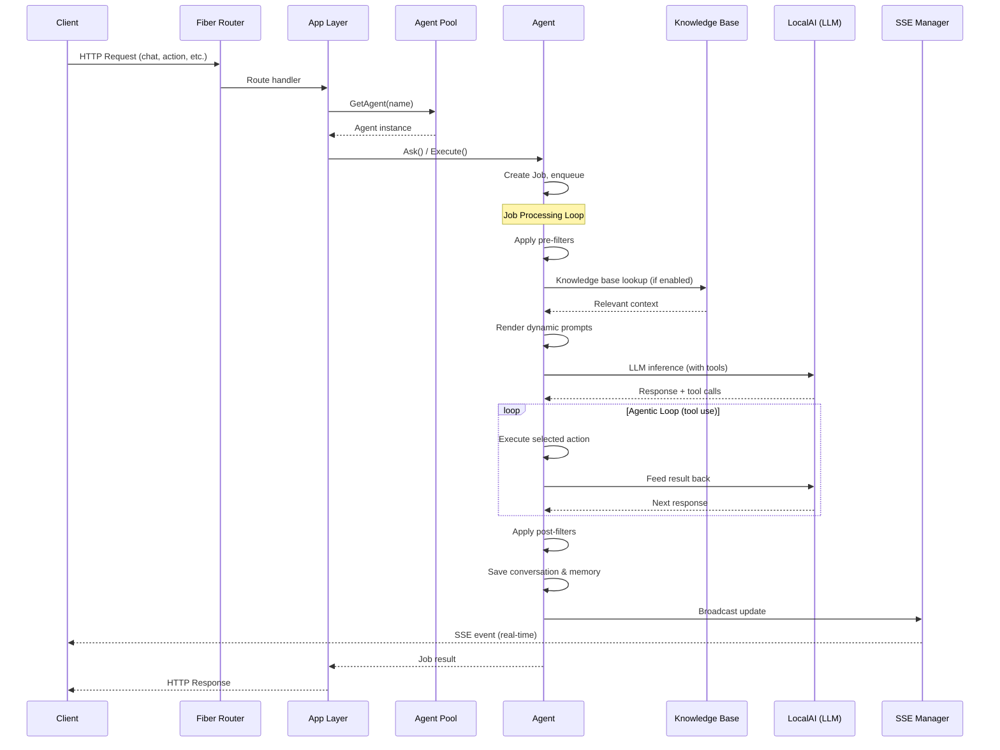

### Connector-Initiated Flow

Connectors (Slack, Discord, Telegram, etc.) run as background goroutines. When they receive an external message, they create a `Job` and submit it to the agent's queue. Results are delivered back through the connector's callback.

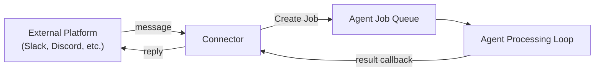

---

## Backend Architecture

### Agent Runtime (`core/agent/`)

The `Agent` struct is the central runtime unit. Each agent:

- Maintains its own **job queue** (Go channel) processed in a dedicated goroutine
- Holds an **LLM client** (OpenAI-compatible, via the Cogito framework)
- Manages **MCP sessions** for tool discovery and execution
- Tracks **conversation history** per conversation ID
- Accesses a **knowledge base** for RAG-augmented responses
- Supports **pause/resume** with context-based cancellation

Key files:
- `core/agent/agent.go` — Main agent struct, job loop, LLM interaction
- `core/agent/options.go` — Configuration options
- `core/agent/mcp.go` — Model Context Protocol integration
- `core/agent/knowledgebase.go` — RAG knowledge base recall

### Agent Pool (`core/state/`)

The `AgentPool` manages the lifecycle of all agents:

- Creates, deletes, pauses, and starts agents
- Persists agent configurations to `pool.json`
- Provides the RAG provider (HTTP or embedded) to agents
- Tracks SSE managers for real-time client communication

### Type System (`core/types/`)

Core abstractions:

- **`Job`** — A unit of work with conversation history, available tools, callbacks, and metadata
- **`Action`** — Interface for executable tools (built-in and user-defined)
- **`JobFilter`** — Pre/post-processing hooks on jobs
- **`ConversationMessage`** — Message with role, content, and metadata
- **`AgentInternalState`** — Short-term memory: current task, next steps, history, goal

---

## Model Loading and Inference Pipeline

LocalAGI does not load models directly. It delegates all inference to **LocalAI**, an external service that handles model management, quantization, and GPU/CPU execution.

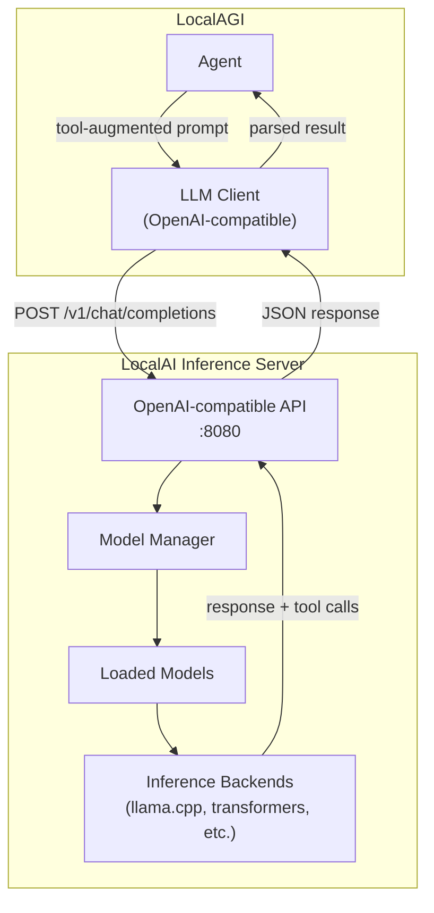

**Model configuration** is set per-agent:

| Model Type | Environment Variable | Purpose |
|---|---|---|
| Base model | `LOCALAGI_MODEL` | Primary text generation |
| Multimodal model | `LOCALAGI_MULTIMODAL_MODEL` | Vision and multimodal input |
| Transcription model | `LOCALAGI_TRANSCRIPTION_MODEL` | Audio-to-text |
| TTS model | `LOCALAGI_TTS_MODEL` | Text-to-speech |
| Embedding model | `EMBEDDING_MODEL` | Vector embeddings for RAG |

---

## API Layer Architecture

The API is built on the **Fiber** web framework (Go) and provides REST endpoints grouped by concern:

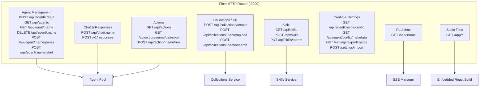

**OpenAI Compatibility**: The `/v1/responses` endpoint provides a drop-in replacement for OpenAI's Responses API, enabling agents to be used by any OpenAI-compatible client.

**Authentication**: Optional API key authentication configured via `LOCALAGI_API_KEYS` (comma-separated list).

---

## Web UI Architecture

The frontend is a **React 19 SPA** built with Vite and bundled into the Go binary via `embed.FS`.

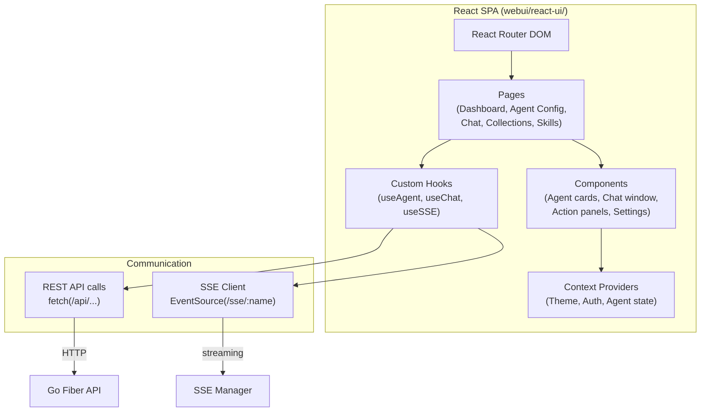

**Build pipeline**: The React app is built with `bun` (package manager) and Vite (bundler). The compiled output is embedded into the Go binary at compile time, so the entire application ships as a single binary.

**Key UI capabilities**:
- No-code agent creation and configuration
- Real-time chat with streaming responses
- Agent status monitoring and observability
- Knowledge base management (collections, file uploads, search)
- Skill management (create, edit, import/export, git sync)
- Agent import/export

---

## P2P Networking Architecture

LocalAGI supports **agent-to-agent communication** through direct HTTP calls. Agents can invoke other agents as actions, enabling cooperative multi-agent workflows.

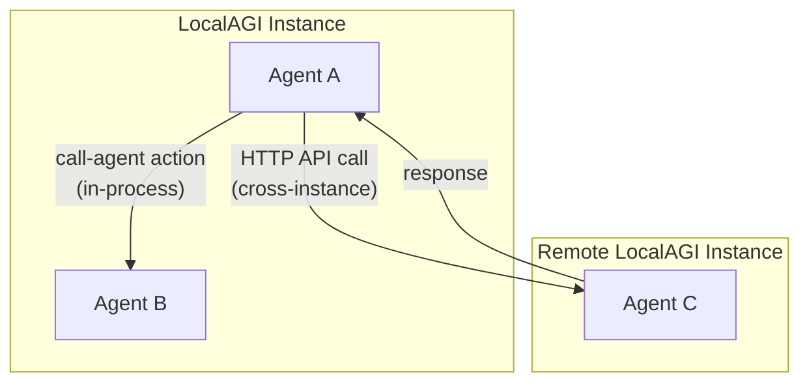

**Agent teaming**: Multiple agents can be created from a single prompt and configured to collaborate. Each agent has a defined role and can call other agents as tools through the built-in `call-agent` action.

**MCP (Model Context Protocol)**: Agents can connect to external MCP servers (HTTP or stdio-based) to discover and use additional tools, enabling interoperability with the broader MCP ecosystem.

---

## Deployment Architecture

### Standard Docker Compose Deployment

The default deployment uses Docker Compose with five services:

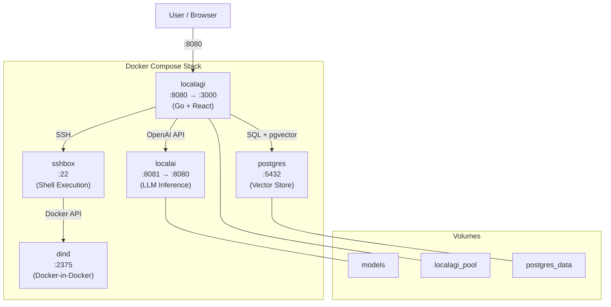

| Service | Image | Purpose |
|---------|-------|---------|
| `localagi` | Custom (Dockerfile.webui) | Main application server |
| `localai` | `localai/localai:master` | LLM inference, embeddings |
| `postgres` | `localrecall:*-postgresql` | Vector storage via pgvector |
| `sshbox` | Custom (Dockerfile.sshbox) | Sandboxed shell execution |
| `dind` | `docker:dind` | Docker-in-Docker for agent scripts |

### GPU Variants

Specialized compose files support different GPU backends:
- `docker-compose.nvidia.yaml` — NVIDIA CUDA
- `docker-compose.amd.yaml` — AMD ROCm
- `docker-compose.intel.yaml` — Intel SYCL

### Minimal Deployment

For CPU-only or external LLM setups, only the `localagi` service is required. Point `LOCALAGI_LLM_API_URL` to any OpenAI-compatible endpoint.

---

## Scalability Considerations

### Current Architecture Boundaries

LocalAGI is designed as a **single-instance, self-hosted application**. The architecture optimizes for simplicity and privacy over horizontal scaling.

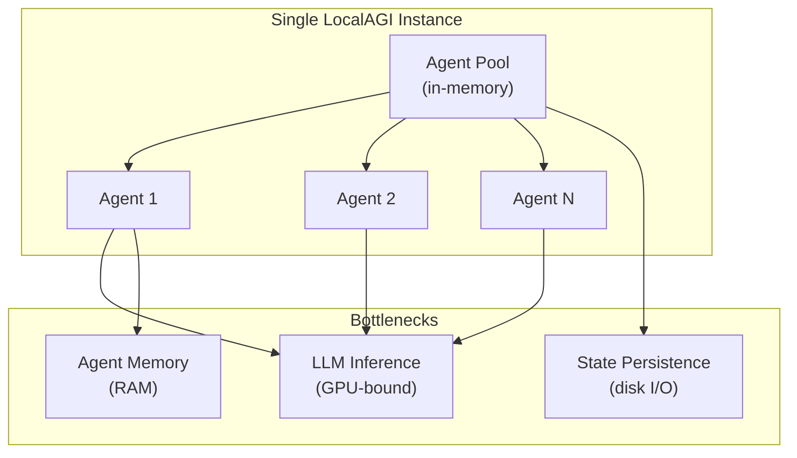

**Vertical scaling levers**:
- Add more GPU VRAM to run larger models or more concurrent inferences
- Increase RAM for more agents and larger knowledge bases
- Use faster storage (NVMe) for state persistence and vector search

**Horizontal scaling patterns**:
- Run multiple LocalAGI instances behind a load balancer, each managing a subset of agents
- Use an external PostgreSQL instance shared across instances for knowledge base
- Point multiple instances at a shared LocalAI cluster for inference

### Agent Concurrency

Each agent processes jobs sequentially from its own queue (Go channel). Multiple agents run concurrently. The primary bottleneck is LLM inference throughput — multiple agents competing for the same LLM endpoint will queue at the inference layer.

---

## Performance Bottlenecks and Optimization

| Bottleneck | Impact | Mitigation |
|---|---|---|
| **LLM inference latency** | Dominates end-to-end response time | Use smaller/quantized models; batch inference in LocalAI; use GPU acceleration |
| **Embedding generation** | Slows knowledge base ingestion and search | Use lightweight embedding models (e.g., `granite-embedding-107m-multilingual`); pre-compute embeddings |
| **Vector search** | Scales with collection size | Use PostgreSQL with pgvector indexing; tune chunk sizes (`MAX_CHUNKING_SIZE`, `CHUNK_OVERLAP`) |
| **Agentic loops** | Multiple LLM round-trips per request | Limit tool call depth; use capable models that resolve in fewer iterations |
| **Memory usage** | Grows with number of agents and conversation history | Configure conversation duration (`LOCALAGI_CONVERSATION_DURATION`); use memory compaction |
| **State persistence** | Disk I/O on pool/agent save | Use fast local storage; state writes are infrequent |

**Optimization tips**:
- Start with smaller models (e.g., `gemma-3-4b-it-qat`) and scale up as needed
- Enable knowledge base only on agents that need it
- Tune `LOCALAGI_TIMEOUT` to fail fast on stuck inferences
- Use the in-process vector engine (`chromem`) to avoid PostgreSQL overhead for small deployments

---

## Security Architecture

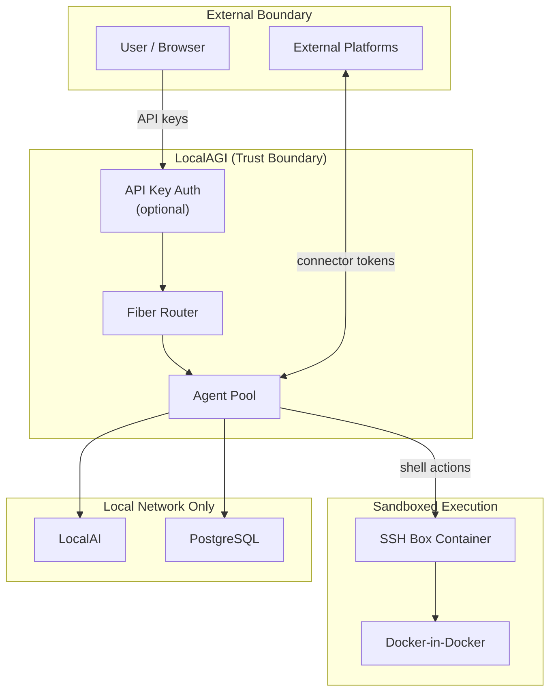

### Key Security Properties

**Data sovereignty**: All data stays on the user's hardware. No external API calls are required for core functionality. LLM inference, embeddings, and vector search all run locally.

**API authentication**: Optional API key authentication protects the REST API. Keys are configured via `LOCALAGI_API_KEYS`.

**Sandboxed execution**: Shell commands run inside an isolated SSH container (`sshbox`), which connects to a Docker-in-Docker instance. This prevents agent-executed code from accessing the host system.

**Connector credentials**: Platform tokens (Slack, Discord, Telegram, etc.) are stored in agent configuration files within the state directory. Protect the state directory with appropriate file permissions.

### Security Recommendations

- **Always enable API keys** in production deployments
- **Restrict network access** — LocalAI and PostgreSQL should not be exposed to the public internet
- **Protect the state directory** — it contains agent configs, credentials, and conversation history
- **Review custom actions** — user-defined Go actions execute within the LocalAGI process
- **Use Docker isolation** — the SSH box and DinD containers limit blast radius of agent-executed code
- **Keep services updated** — regularly update LocalAI and PostgreSQL for security patches
